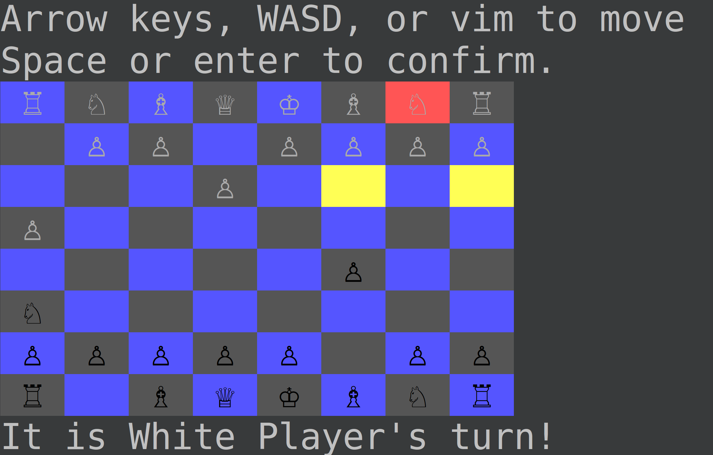

# Chess

### How to Install and Play

* Clone this repository to your machine
* Navigate to the repos directory and run  `ruby game.rb ` from the terminal
* Use Arrow keys, WASD or VIM controls to navigate, and space or enter to select 
* Moves consist of two pieces
    1) select the piece you want to move 
    2) select where to move the piece.
* **NB** : You may want to zoom in on the terminal for a more enjoyable experience

#### Screenshot

#### Todos
* Implement a smarter Computer AI